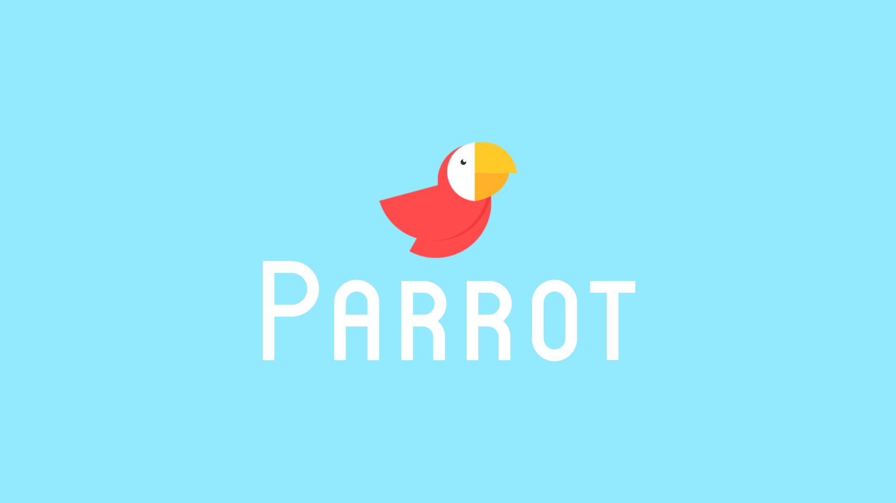
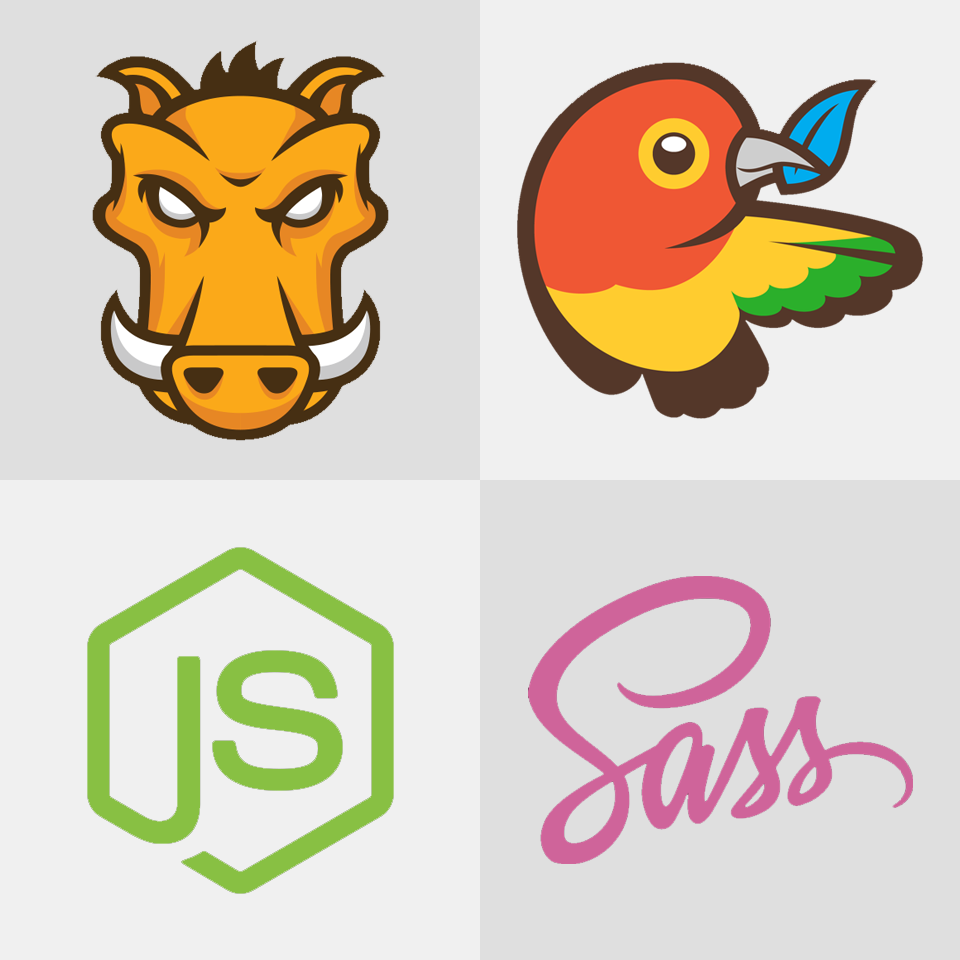
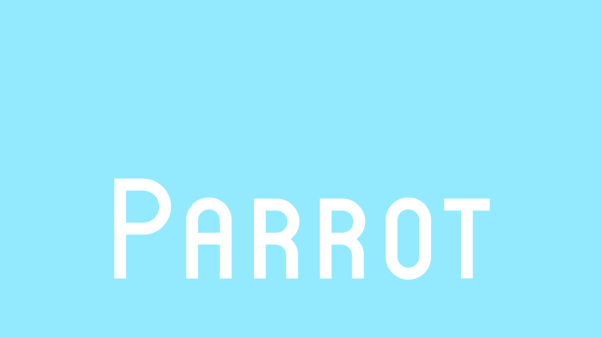

# Parrot
Parrot structures the code for your next project nicely and comes with many useful tools.



| Dependency Status | devDependency Status |
| ----------------- | -------------------- |
| [](https://david-dm.org/HeliumSquid/parrot) | [](https://david-dm.org/HeliumSquid/parrot#info=devDependencies) |

## Contents

- [Files](#files)
- [Install](#install)
- [Dependencies](#dependencies)


## Files

        parrot
        | -- assets/
        |   | -- css/
        |   |   | -- 0-tools/
        |   |   |   | -- colours.sass
        |   |   |   | -- fonts.scss
        |   |   |   | -- normalize.scss
        |   |   | -- 1-base/
        |   |   |   | -- base.sass
        |   |   |   | -- links.sass
        |   |   |   | -- buttons.sass
        |   |   | -- 2-pages/
        |   |   |   | -- page-home.sass
        |   |   | -- main.css
        |   |   | -- main.sass
        |   | -- js/
        |   |   | -- jquery-2.4.1.min.js
        |   |   | -- main.js
        |   | -- img/
        | -- .gitignore
        | -- gruntfile.js
        | -- license (MIT)
        | -- readme.md
        | -- bower.json
        | -- index.html
        | -- package.json

## Install

### Manually

Download the [latest release](https://github.com/HeliumSquid/parrot/archive/master.zip).

## Dependencies



You'll need the following installed:

- Latest Sass: `$ gem install sass`
- Latest Grunt CLI: `$ npm install -g grunt-cli`
- [Node.js and npm](https://nodejs.org/download/)
- Latest Bower `$ npm install -g bower`

Now you can install the dependencies:

```bash
$ npm install
$ bower install
```

You can use the default commands:

```bash
$ grunt watch
$ grunt concat
$ grunt uglify
```

Or run them all at once with:

```bash
$ grunt parrot
```

## Have fun using parrot!


