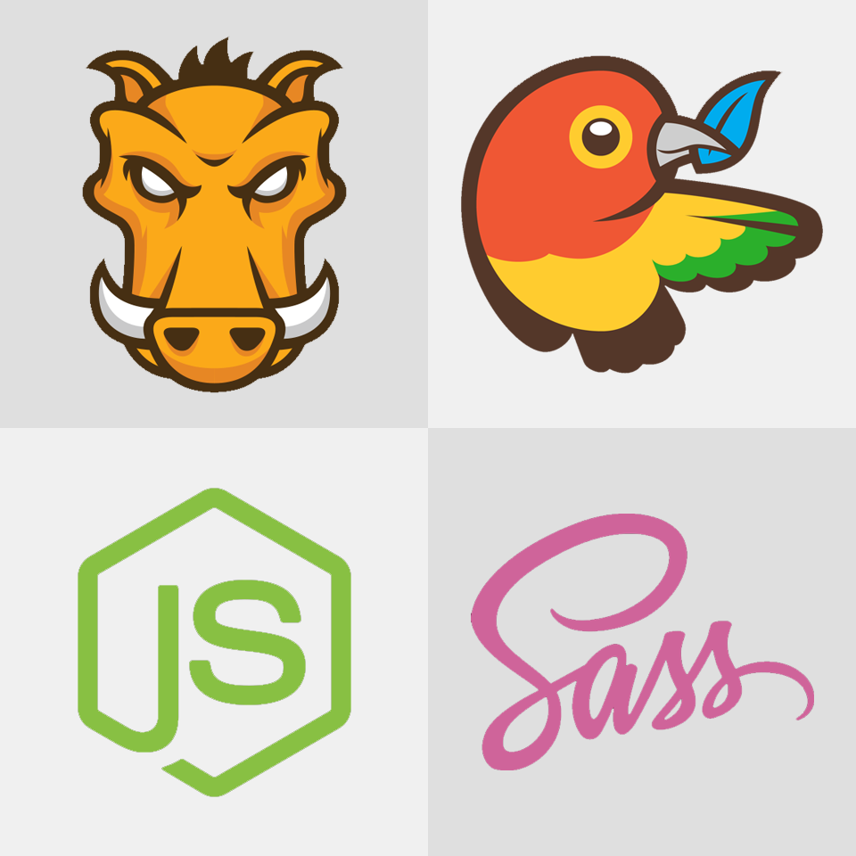

# Parrot
Parrot structures the code for your next project nicely and comes with many useful tools.

## Files

        parrot
        | -- assets/
        |   | -- css/
        |   |   | -- 0-tools/
        |   |   |   | -- colours.sass
        |   |   |   | -- fonts.scss
        |   |   |   | -- normalize.scss
        |   |   | -- 1-base/
        |   |   |   | -- base.sass
        |   |   |   | -- links.sass
        |   |   |   | -- buttons.sass
        |   |   | -- 2-pages/
        |   |   |   | -- page-home.sass
        |   |   | -- main.css
        |   |   | -- main.sass
        |   | -- js/
        |   |   | -- jquery-2.4.1.min.js
        |   |   | -- main.js
        |   | -- img/
        | -- .gitignore
        | -- gruntfile.js
        | -- license (MIT)
        | -- readme.md
        | -- bower.json
        | -- index.html
        | -- package.json

## Tools

